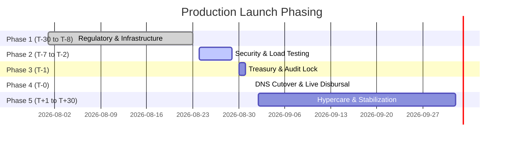

# Oryx Fund — Production Launch Checklist

## Phased Launch Timeline

---

## Phase 1: Infrastructure, Integration & Regulatory Clearance (T-30 to T-8 Days)

- [x] **CHK-REG-01 (Statutory Compliance):** Validate full DCP license compliance with CBK, Data Controller registration with ODPC, and AML/CFT reporting integration with FRC. *(Sign-off: Lead Compliance Officer)*
- [x] **CHK-INF-01 (Infrastructure):** Deploy AWS `af-south-1` primary EKS, Aurora Multi-AZ PostgreSQL, and Redis clusters via Terraform with IaC security baselines. *(Sign-off: Lead DevOps Engineer)*
- [x] **CHK-CRB-01 (External Integrations):** Execute sandbox-to-production certification for Metropol, TransUnion, and Creditinfo API endpoints. *(Sign-off: Lead Integration Engineer)*
- [x] **CHK-MPESA-01 (Payment Rails):** Complete Safaricom Daraja 2.0 production KYC, generate B2C initiator credentials, encrypt passwords via Safaricom Public Key, and configure Paybill C2B URLs. *(Sign-off: Lead Payment Engineer)*
- [x] **CHK-SEC-01 (Security & IAM):** Configure AWS KMS CMKs, deploy Envelope Encryption libraries, initialize CloudHSM / Vault, and enforce WebAuthn MFA. *(Sign-off: Chief Security Officer)*

---

## Phase 2: Pre-Flight Verification & Penetration Testing (T-7 to T-2 Days)

- [ ] **CHK-PEN-01 (Penetration Testing):** Execute CREST-certified external penetration test against Cloudflare edge, APIs, and Admin Underwriting Desk. Remediate all High/Critical CVEs. *(Sign-off: CSO / External Auditor)*
- [ ] **CHK-LOAD-01 (Stress & Load Testing):** Execute simulated load test (5,000 concurrent loan applications, 100 disbursements/sec) to verify PgBouncer connection pooling and Redis Redlock concurrency. *(Sign-off: Lead SRE)*
- [ ] **CHK-MATH-01 (Financial Decimal Precision):** Verify 100% pass rate on Decimal amortization math, 20% KRA Excise Duty deductions, and CBK 5-tier provisioning test suites with zero floating-point rounding errors. *(Sign-off: Lead Financial Engineer)*
- [ ] **CHK-DR-01 (Disaster Recovery Rehearsal):** Conduct live failover test promoting `eu-west-1` read replica to standalone primary; verify RPO < 1m and RTO < 15m. *(Sign-off: Principal Systems Architect)*

---

## Phase 3: Final Production Cutover & Rehearsal (T-1 Day)

- [ ] **CHK-TREAS-01 (Treasury Pre-Funding):** Confirm pre-funding of Safaricom M-Pesa B2C Bulk Disbursement Utility float (KES 50,000,000 minimum operational reserve). *(Sign-off: Fund Manager / CFO)*
- [ ] **CHK-AUDIT-01 (WORM Compliance):** Verify AWS S3 Object Lock Compliance Mode active on audit logging buckets; execute write-immutability validation tests. *(Sign-off: Lead Compliance Officer)*
- [ ] **CHK-DB-01 (Database Engine):** Execute production database migrations, verify initial Chart of Accounts integrity, confirm PgBouncer connection pool limits. *(Sign-off: Lead Database Architect)*
- [ ] **CHK-OPS-01 (Operations & Runbooks):** Verify all operational staff have active hardware MFA tokens, access levels mapped, and emergency offboarding scripts tested. *(Sign-off: Chief Security Officer)*

---

## Phase 4: Go-Live Day Execution (T-0)

- [ ] **CHK-GO-01 (Edge Routing):** Update Cloudflare Anycast DNS records; point public domains (`oryxfund.ke`) to production AWS NLB ingress gateways. *(Sign-off: Principal Systems Architect)*
- [ ] **CHK-SMOKE-01 (Synthetic Disbursal Test):** Execute single end-to-end synthetic transaction on live infrastructure: submit application $\rightarrow$ score via CRB $\rightarrow$ sanction $\rightarrow$ disburse KES 1,000 over M-Pesa B2C. *(Sign-off: Executive Engineering Desk)*
- [ ] **CHK-TEL-01 (Observability Verification):** Confirm telemetry signals streaming to Grafana, OpenTelemetry spans active, Sentry reporting error-free status, PagerDuty on-call active. *(Sign-off: Lead SRE)*

---

## Phase 5: Post-Launch Hypercare & Stabilization (T+1 to T+30 Days)

- [ ] **CHK-POST-01 (Daily Financial Reconciliation):** Daily 00:05 automated reconciliation of Safaricom Daraja statements against PostgreSQL general ledger balances. *(Sign-off: Treasury / Lead Accountant)*
- [ ] **CHK-POST-02 (Weekly Portfolio Risk Reviews):** Weekly review of PAR 30, PAR 60, PAR 90 tracking curves; evaluate IFRS 9 ECL provisioning accuracy against early delinquency trends. *(Sign-off: Lead Financial Engineer)*
- [ ] **CHK-POST-03 (Monthly Regulatory Filings):** Prepare statutory monthly CRB data submissions and CBK liquidity and compliance metrics reports. *(Sign-off: Lead Compliance Officer)*
