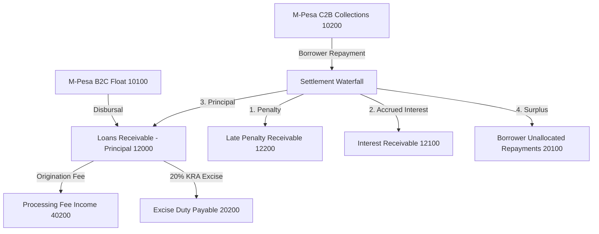
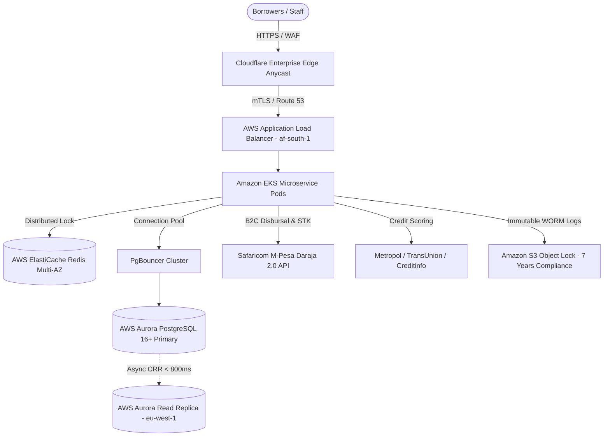

# Oryx Fund — Production Readiness & Institutional Architecture Blueprint

## Executive Summary & Statutory Framework

Oryx Fund is an institutional digital lending fund and underwriting platform headquartered in Nairobi, Kenya. The production system is engineered in strict compliance with the **Central Bank of Kenya (CBK) Digital Credit Providers (DCP) Regulations 2022**, the **Kenya Data Protection Act 2019 (ODPC)**, the **National Payment System Act (Cap 491A)**, **POCAMLA (Anti-Money Laundering)**, and the **Credit Reference Bureau (CRB) Regulations 2020**.

---

## Dimension A: Core Architecture & Backend Ledger Integration

### 1. Double-Entry Accounting Ledger & Chart of Accounts (COA)

The core accounting engine adheres to strict double-entry bookkeeping where every balance movement requires equal debits and credits within atomic transaction envelopes.

| Account Code | Account Name | Type | Normal Balance | Description |
| :--- | :--- | :--- | :--- | :--- |
| **10100** | M-Pesa B2C Utility Float | Asset | Debit | Liquid disbursal float held at Safaricom |
| **10200** | M-Pesa C2B Collections Float | Asset | Debit | Incoming borrower repayments clearing account |
| **10300** | Commercial Bank Settlement Float | Asset | Debit | Institutional bank clearing account (KEPSS/RTGS) |
| **12000** | Loans Receivable – Principal | Asset | Debit | Gross outstanding loan principal balances |
| **12100** | Interest Receivable – Accrued | Asset | Debit | Contractual interest accrued on reducing-balance |
| **12200** | Late Penalty Receivable | Asset | Debit | Statutory late payment penalties accrued |
| **12900** | Allowance for Credit Losses (ECL) | Contra-Asset | Credit | Balance sheet provision for impairment losses |
| **20100** | Borrower Unallocated Repayments | Liability | Credit | Suspense account for unverified/unmatched C2B funds |
| **20200** | Excise Duty Payable (KRA) | Liability | Credit | 20% statutory excise duty collected on fees |
| **21000** | Senior Debt / Institutional LP Capital | Liability | Credit | Credit lines funding balance sheet loans |
| **30100** | Retained Earnings | Equity | Credit | Cumulative retained platform operating surplus |
| **40100** | Interest Income | Revenue | Credit | Recognized interest yield amortized over facility tenors |
| **40200** | Processing Fee Income | Revenue | Credit | Platform origination and underwriting fee revenue |
| **40300** | Penalty & Late Fee Revenue | Revenue | Credit | Default charges assessed on delinquent loans |
| **50100** | Provision Expense for Bad Debts | Expense | Debit | P&L charge matching balance sheet ECL movements |
| **50200** | Payment Gateway & Rail Expenses | Expense | Debit | M-Pesa Daraja, CRB inquiry, and banking rail costs |
| **50300** | Principal Loan Write-Off | Expense | Debit | Terminal realization of uncollectable loan balances |

---

### 2. CBK Delinquency Categorization & IFRS 9 ECL Provisioning

The platform executes simultaneous dual-engine accounting for loan loss provisions: regulatory compliance under CBK DCP Regulations 2022 and financial reporting under IFRS 9.

| CBK Classification | DPD Range | IFRS 9 Stage | Minimum Provision | Impairment Description |
| :--- | :--- | :--- | :--- | :--- |
| **Normal** | 0 – 30 Days | Stage 1 (Performing) | **1.00%** | Low credit risk; 12-month ECL recognized |
| **Watch** | 31 – 60 Days | Stage 2 (Underperforming) | **3.00%** | Significant Increase in Credit Risk (SICR); Lifetime ECL |
| **Substandard** | 61 – 90 Days | Stage 3 (Non-Performing) | **20.00%** | Objective evidence of impairment; cash flow inadequacy |
| **Doubtful** | 91 – 180 Days | Stage 3 (Non-Performing) | **50.00%** | Collection in full improbable; loss imminent |
| **Loss** | 180+ Days | Stage 3 (Write-off) | **100.00%** | Uncollectable; terminal write-off recognized |

---

### 3. Financial Engineering Formulas

1. **Reducing-Balance Monthly Installment (EMI):**
   $$EMI = \frac{P \cdot r \cdot (1+r)^n}{(1+r)^n - 1}$$
   Where $P$ is principal, $r$ is monthly effective rate, and $n$ is tenor in months.

2. **Kenyan 20% KRA Excise Duty on Processing Fees:**
   $$\text{Net Processing Fee} = P \times \text{Fee Rate}$$
   $$\text{Excise Duty (KRA)} = \text{Net Fee} \times 0.20$$
   $$\text{Gross Fee Deduction} = \text{Net Fee} + \text{Excise Duty}$$
   $$\text{Net Disbursed via M-Pesa} = P - \text{Gross Fee Deduction}$$

3. **Portfolio at Risk (PAR):**
   $$PAR_N = \frac{\sum \text{Principal of Loans Overdue } \ge N \text{ Days}}{\text{Gross Loan Portfolio Principal}} \times 100\%$$

4. **Loan Collection Efficiency Rate:**
   $$CE_t = \frac{\text{Actual Recoveries}_t}{\text{Scheduled Due}_t} \times 100\%$$

---

## Dimension B: High-Availability Infrastructure & Scalability

* **Deployment Topology:** Primary region `af-south-1` (Cape Town, South Africa) for sub-40ms latency to Safaricom in Nairobi; secondary disaster recovery region `eu-west-1` (Dublin).
* **RPO & RTO Objectives:** RPO < 1 Minute, RTO < 15 Minutes.
* **Database Partitioning:** PostgreSQL declarative range partitioning on `booking_date` (monthly partitions) with indexed composite keys (`account_code`, `booking_date`, `facility_id`).

---

## Dimension C: Security, Cryptography & Compliance Hardening

1. **Authentication & Authorization:**
   * OAuth 2.0 / OIDC with PKCE.
   * Asymmetric Ed25519 / RS256 JWT tokens.
   * Mandatory FIDO2 / WebAuthn hardware security keys (YubiKey 5) for Clearance Levels 3 & 4.
2. **Field-Level Envelope Encryption (AES-256-GCM):**
   * Customer PII (`national_id`, `kra_pin`, `phone`, `bank_account`, `crb_raw_blob`) is encrypted at the application layer using dynamic Data Encryption Keys (DEKs) wrapped by AWS KMS Customer Managed Keys.
3. **Immutable WORM Audit Trail (7 Years):**
   * Stored in Amazon S3 with Object Lock in Compliance Mode.
   * Cryptographic SHA-256 hash chaining:
     $$H_i = \text{SHA-256}(E_i \parallel T_i \parallel A_i \parallel \Delta_i \parallel H_{i-1})$$

---

## Dimension D: Observability, Telemetry & Operational Alerting

### Real-Time Telemetry Matrix

| Metric | Target Baseline | Critical Alert Threshold | Action |
| :--- | :--- | :--- | :--- |
| **M-Pesa B2C Success Rate** | **$\ge 99.8\%$** | $< 95.0\%$ over 5 min | P0 PagerDuty, trip circuit breaker, queue payouts |
| **Utility Float Runway** | **$\ge 7$ Operating Days** | $< 2$ Operating Days | Automated treasury sweep from bank float into B2C shortcode |
| **Portfolio at Risk (PAR 30)** | **$< 3.0\%$** | $> 5.0\%$ | Auto-tighten credit score cut-off from 450 to 520 |
| **Non-Performing Loans (NPL)** | **$< 5.0\%$** | $> 8.0\%$ | Immediate credit committee review & risk re-indexing |
| **Collection Efficiency** | **$\ge 98.0\%$** | $< 92.0\%$ | Trigger automated SMS/WhatsApp delinquency reminders |

---

## Dimension E: Production Operations & Runbooks

### Runbook 1: Safaricom M-Pesa Gateway Outage / Degradation
1. **Detection:** Prometheus alert `PAY-001` triggers when B2C failure rate exceeds 5%.
2. **Containment:** System enters Degraded Queueing Mode; disbursements marked `ENQUEUED_PENDING_GATEWAY`.
3. **Borrower Banner:** Real-time banner rendered: *"M-Pesa payment processing is experiencing network delays. Your approved loan will disburse automatically upon channel restoration."*
4. **Backlog Drainage:** Upon restoration, payment worker drains queue using token-bucket rate limiter ($\le 15 \text{ TPS}$) protected by distributed Redis Redlock.

### Runbook 2: Disputed Repayments & Suspense Account (20100)
1. **Case A (Landed in Suspense):** Borrower used incorrect loan reference on Paybill C2B. Senior Underwriter matches transaction, clicks **Allocate Suspense Funds**, debiting `20100` and crediting `12000` / `12100`.
2. **Case B (Missing from Oryx System):** Issue manual Daraja `/mpesa/transactionstatus/v1/query`. Inject confirmed callback through idempotent reconciliation pipeline.

---

## Dimension F: Role-Based Access Control (RBAC) Matrix

| Permission / Action | Level 1: Loan Officer | Level 2: Underwriter | Level 3: Senior Underwriter | Level 4: Fund Manager / CSO | Level 5: Compliance / Audit |
| :--- | :--- | :--- | :--- | :--- | :--- |
| **Initiate Draft Application** | Yes | Yes | Yes | No | No |
| **View Redacted PII** | Yes | Yes | Yes | Yes | Yes |
| **View Unmasked PII** | No | No | Break-Glass | Break-Glass | Yes |
| **Query CRB Credit Report** | No | Yes | Yes | Yes | No |
| **Sanction Facility ($\le \text{500K}$)** | No | Yes | Yes | Yes | No |
| **Sanction Facility ($> \text{500K}$)** | No | No | Yes | Yes | No |
| **Authorize Manual Override** | No | No | No | Yes | No |
| **Balance Sheet Write-off** | No | No | No | Dual-Auth | No |
| **View Ledger & Trial Balance** | No | No | Read-Only | Full Access | Read-Only |
| **Export WORM Audit Logs** | No | No | No | No | Yes (Read-Only) |
